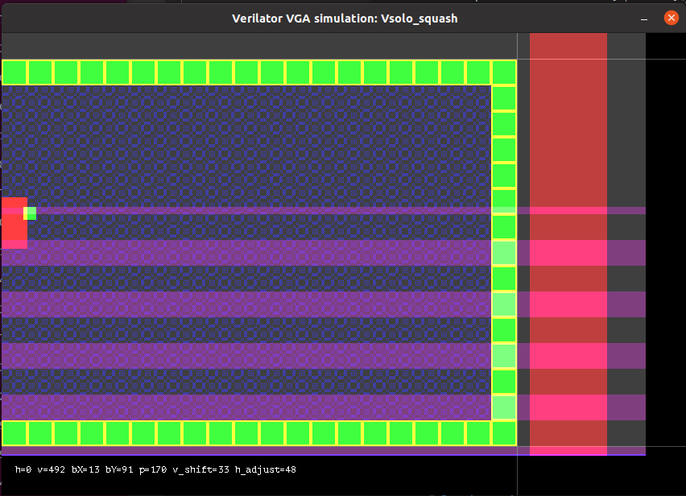

# Solo Squash

This is a simple hardware video game that I'm developing as a possible
student submission for the [Zero to ASIC course](https://zerotoasiccourse.com/).

It is a Verilog HDL project that implements a primitive digital-logic-based
video game that resembles Pong, but with one player just bouncing a ball
within a 3-walled space, resembling a game of
[squash](https://en.wikipedia.org/wiki/Squash_(sport)) but with just 1 paddle.


# License

This repo is licensed with [Apache 2](LICENSE).

# Details

This is intended to drive a VGA display at 640x480 resolution, ~60Hz.

It has been tested on a DE0-Nano FPGA board (Altera Cyclone IV),
and I hope to submit this as part of the Google Skywater project to
be made into an ASIC.

An older, more-compact version (without colour or patterns) has also
been tested on an XC9572XL CPLD, but it's a tight fit!

# Hardware

**SCHEMATIC COMING SOON**

Key parts:
*   25.175MHz clock source (though 25.000MHz is good enough).
*   Buttons (all with pull-ups): Up, Down, Pause, New Game, optional Reset
*   VGA connector: HSYNC and VSYNC via 100&ohm; resistors and R, G, B each via 270&ohm; resistors
    (assuming 3.3V outputs rather than 5V).

# Visual simulation with Verilator

Make sure SDL2 dev packagers are installed:
```bash
sudo apt-get update
sudo apt install libsdl2-dev libsdl2-ttf-dev
```

Then hopefully you can run the following and it will build and run the simulator,
popping up a window that shows the game in action.
```bash
make clean sim
```

You can also simulate with various init states, too:
```bash
# Each of these builds and simulates, with all unassigned bits starting at...
make clean sim          # ...0
make clean sim_ones     # ...1
make clean sim_seed     # ...predictable random values based on SEED (set in Makefile or overridden via command-line)
make clean sim_random   # ...unpredictable random values each time. 
```

**Reset** is not asserted automatically at the start of simulation. This is evident if
you run `make clean_sim run_sim_random`, in which case the ball and paddle will start
in random (and sometimes invalid) positions.

## Virtual VGA display



**NOTES** about what you see in the screenshot above:
*   The background is grey and not black because the region that got rendered
    between SDL refreshes gets its lower bits set to visually show what's being updated
    each time. To toggle this, use the <kbd>H</kbd> key.
*   Purple bars are a visualisation of when the speaker signal is on. This is
    hard to simulate especially when the video speed isn't realtime, and visualisation
    of exactly when it turns on (and off) in relation to the video rendering is probably
    more useful anyway. I think I could probably get away with an audio sim just buffering
    until the end of the frame, and then playing it in realtime when VSYNC arrives.
    This should at least "feel" right and sound at the right tone.
*   Regions outside the main playfield area are typically called "overscan" and allow us
    to visualise the "front porch", "sync", and "back porch" signals for each of
    HSYNC (red) and VSYNC (blue).
*   Regions even further outside this (seen as black to the right
    and at the bottom) should not get any video signal crossing into them, except
    maybe during the simulator's initial attempt to lock on to the video signal.
    Anything that DOES make it into this region should decay back to black after a short while.
*   Faint horizontal and vertical lines are showing what a VGA monitor would probably sense
    as the actual exact visible area of the display.


## Simulator Hotkeys

| Key           | Function |
|---------------|----------|
| Space         | Pause simulator |
| H             | Toggle refresh highlight |
| N             | New game signal |
| P             | Assert Pause signal to game    |
| Q             | Quit     |
| R             | Reset    |
| V             | Toggle VSYNC logging |
| X             | Turn on eXamine mode: Pause simulator if last frame had any tone generation |
| S             | Step-examine: Unpause, but with examine mode on again |
| F             | NOT IMPLEMENTED: Step by 1 full frame |
| + (Keypad)    | Increase refresh period by 1000 cycles |
| - (Keypad)    | Decrease refresh period by 1000 cycles |
| 1             | Refresh after every pixel (VERY slow) |
| 2             | Refresh after every line |
| 3             | Refresh after every 10 lines |
| 4             | Refresh after every 80 lines |
| 5             | Refresh exactly on every frame |
| 6             | Refresh exactly every 3 frames |
| 9             | Refresh after every 100 pixels (better for observing repaint within frames) |

**Examine mode** is currently programmed to help observe what happens with tone generation:
1.  Hit X to turn on examine mode.
2.  As soon as a frame completes that included the speaker being turned on, go into PAUSE.
3.  You can either just resume with P, or step through each subsequent examine trigger with S.

**NOTE**: With the current implementation, speaker tones will typically "spill over" into the very
top of the "next frame" (as detected by the end of VSYNC) and so this will trip examine mode
again. This is normal; just expect examine mode to trip at least 2 times per ball hit.


# Contents

*   [`src/`](./src/)
    *   Verilog source for the project.
*   [`sim/`](./sim/)
    *   C++ code for Verilator-driven SDL-based VGA simulation.
*   [`test/`](./test/)
    *   Where we'll start to put files that are needed for formal verification.

# Requirements

**TBC!**

Not all of these are necessarily required together. Some are just for different
types of tests:

*   Icarus Verilog (iverilog)
*   Verilator + SDL2
*   Python + cocotb
