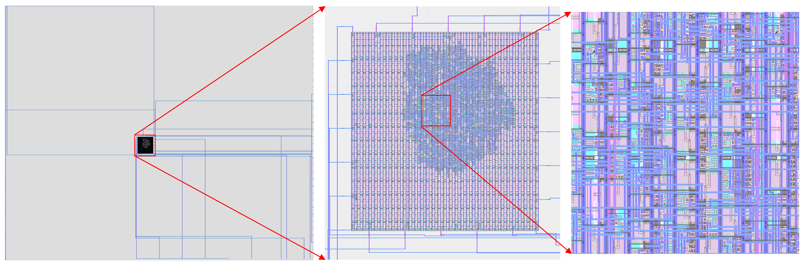

<!--
# SPDX-FileCopyrightText: 2023 Anton Maurovic <anton@maurovic.com>
#
# Licensed under the Apache License, Version 2.0 (the "License");
# you may not use this file except in compliance with the License.
# You may obtain a copy of the License at
#
#      http://www.apache.org/licenses/LICENSE-2.0
#
# Unless required by applicable law or agreed to in writing, software
# distributed under the License is distributed on an "AS IS" BASIS,
# WITHOUT WARRANTIES OR CONDITIONS OF ANY KIND, either express or implied.
# See the License for the specific language governing permissions and
# limitations under the License.
# SPDX-License-Identifier: Apache-2.0
-->

# Solo Squash (a Caravel User Project)

[](https://opensource.org/licenses/Apache-2.0)

## Overview

This is a simple hardware video game digital design made by
[Anton Maurovic](https://github.com/algofoogle),
as a possible student submission for the [Zero to ASIC course](https://zerotoasiccourse.com/),
and in this case designed to target a [Caravel](https://github.com/efabless/caravel.git) ASIC
as part of the Google Skywater
[Open MPW shuttle program](https://efabless.com/open_shuttle_program/),
in collaboration with [Efabless](https://efabless.com/).



The design itself is a Verilog HDL project that implements a primitive digital-logic-based
video game that resembles Pong, but with one player just bouncing a ball
within a 3-walled space, resembling a game of
[squash](https://en.wikipedia.org/wiki/Squash_(sport)) but with just 1 paddle.

To read a lot more about this project, see the much-more-detailed README for the
base design in my [`solo_squash` repo](https://github.com/algofoogle/solo_squash).

## License

This repo, the project itself, and all related files are licensed with [Apache 2](LICENSE).

## Details

This is intended to drive a VGA display at 640x480 resolution, ~60Hz,
and it could be adapted to different targets, including FPGA,
Verilator-based VGA simulation, and Caravel ASIC.

It has been tested on a DE0-Nano FPGA board (Altera Cyclone IV),
along with Verilator, and other formal testing (i.e.
[Icarus Verilog](http://iverilog.icarus.com/) and
[cocotb](https://www.cocotb.org/)).

Its inputs are:
```
Core:
    clock                       (25.175MHz ideal for VGA, 25.000MHz OK)
                           See: https://caravel-harness.readthedocs.io/en/latest/external-clock.html
    resetb                      (SoC reset, i.e. full reset. Also resets our design)

The following may only be operational after SoC firmware has finished executing
(but that's within a few hundred microseconds of power-up, and only part-way
through the first frame anyway):
    GPIO[ 8]    <- ext_reset_n  (External active-low reset)
    GPIO[ 9]    <- pause_n      (Momentary pause, active-low)
    GPIO[10]    <- new_game_n   (Reset game state without full reset, active-low)
    GPIO[11]    <- up_key_n     (Move paddle up, active-low)
    GPIO[12]    <- down_key_n   (Move paddle down, active-low)
```

Its outputs are:
```
The following may only be active after SoC firmware has finished executing,
and hi-Z otherwise. They also go hi-Z during reset (either resetb or
ext_reset_n being asserted):

    GPIO[13]    -> red          (VGA red channel on/off via 270R resistor => 0.7V nominal)
    GPIO[14]    -> green        (VGA green channel, as above)
    GPIO[15]    -> blue         (VGA blue channel, as above)
    GPIO[16]    -> hsync        (VGA HSYNC, via 100R safety resistor)
    GPIO[17]    -> vsync        (VGA VSYNC, via 100R safety resistor)
    GPIO[18]    -> speaker      (Speaker, ideally should run to an amplifier to avoid overcurrent)

The following may only be active after SoC firmware is finished, but they
remain active even during a reset (for debugging reasons):

    GPIO[19] -> debug_design_reset  (Follows internal reset state, based on ext_reset_n/resetb)
    GPIO[20] -> debug_gpio_ready    (Pulsed by SoC internally to show when GPIO config is finished)
```
